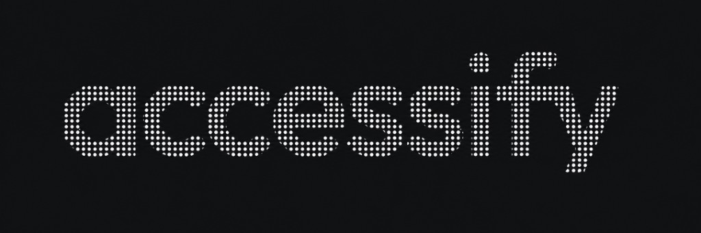
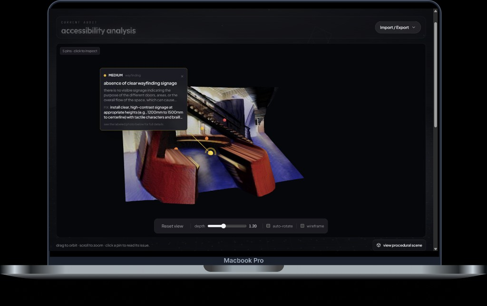
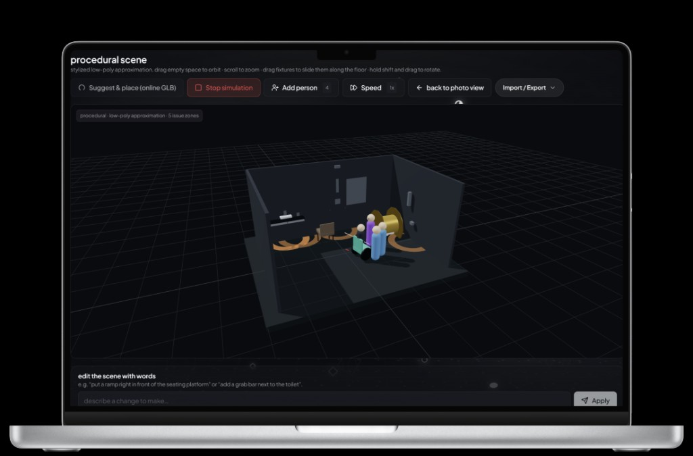

<p align="center">
  
</p>

# Accessify

**Photo in. Walkable 3D accessibility audit out.**

<p align="center">
  
  
</p>

Accessify is a single-page web app that turns one photograph of a built space into an interactive 3D scene populated with disability-aware agents who walk around and report the barriers they hit. The whole pipeline is driven by Gemini 2.5 Flash and a browser-side depth model; there is no cloud render farm and no proprietary 3D format.

This was built for the Natignite 2026 hackathon by team `trihards`. The project name in the UI is **Accessify**.

---

## How to run

```bash
# 1. Install dependencies
npm install

# 2. Add a .env.local file at the project root (Next.js loads it automatically)
cp .env.local.example .env.local
# On Windows PowerShell: Copy-Item .env.local.example .env.local

# 3. Put your Gemini key in .env.local (same file the API routes read)
# Open .env.local and set GOOGLE_API_KEY=... (get a key at https://aistudio.google.com/apikey)

# 4. Start the dev server
npm run dev

# 5. Open the app
# http://localhost:3000
```

Production build:

```bash
npm run build
npm start
```

That's it. See [Quick start](#quick-start) and [Environment variables](#environment-variables) below for more detail.

---

## Table of Contents

1. [How to run](#how-to-run)
2. [What it does](#what-it-does)
3. [Pipeline overview](#pipeline-overview)
4. [Tech stack](#tech-stack)
5. [Quick start](#quick-start)
6. [Project structure](#project-structure)
7. [How it works, feature by feature](#how-it-works-feature-by-feature)
   - [Upload and context capture](#1-upload-and-context-capture)
   - [Depth estimation](#2-depth-estimation-in-browser)
   - [Gemini accessibility analysis](#3-gemini-accessibility-analysis)
   - [Procedural 3D scene](#4-procedural-3d-scene)
   - [Hover banner](#5-hover-banner)
   - [Direct manipulation: drag and rotate](#6-direct-manipulation-drag-and-rotate)
   - [Natural-language scene editor](#7-natural-language-scene-editor)
   - [Online GLB props](#8-online-glb-props-suggest--place)
   - [Agent simulation](#9-agent-simulation)
   - [Live encounters log](#10-live-encounters-log)
8. [API reference](#api-reference)
9. [Data model](#data-model)
10. [Coordinate systems](#coordinate-systems)
11. [Environment variables](#environment-variables)
12. [Limitations and trade-offs](#limitations-and-trade-offs)

---

## What it does

You drop in a photo, and within seconds the app shows you:

1. A **prioritized list of accessibility issues** (severity + category + recommendation + standards reference where relevant), each tied to a specific fixture in the scene where applicable.
2. A **procedural 3D reconstruction** of the room with walls, floor, fixtures (toilet, sink, ramp, step, counter, signage, column, seating, door, grab bar, obstacle), which is built from a JSON layout the model emits alongside the issue list.
3. A **simulation** where ambulatory, wheelchair, and blind/cane users walk around the room and report the barriers each persona actually trips over.
4. A **natural-language editor** so you can type *"put a ramp right in front of the seating"* and watch the scene update in real time.
5. A **drag-and-drop layout** where every fixture can be slid along the floor and rotated, and the agent simulation re-paths around the new positions immediately.

---

## Pipeline overview

```
photo  ─►  Hugging Face depth-anything-v2-small (WebGPU, in-browser)
                      │
                      ▼
              depth map (data URL)
                      │
   user context ─────►│
                      ▼
        POST /api/analyze (Gemini 2.5 Flash, multimodal)
                      │
                      ▼
   { overview, summary, issues[], roomLayout }
                      │
            ┌─────────┴────────────┐
            ▼                      ▼
   AccessibilityReport       Procedural 3D scene
   (issues UI)               (RoomScene + Fixtures)
                                   │
            ┌──────────────────────┼──────────────────────┐
            ▼                      ▼                      ▼
   Drag / rotate          /api/scene-edit         /api/scene-suggestions
   (fixtureOverrides)     ("add a ramp…")         (online GLB props)
                                   │
                                   ▼
                        AgentSimulation (3 personas)
                                   │
                                   ▼
                        Live encounters log
                        (aggregated by issue + persona)
```

---

## Tech stack

| Layer | Library / version |
| --- | --- |
| Framework | Next.js 14.2.18 (App Router), React 18.3.1, TypeScript 5.6 |
| 3D | three 0.169, @react-three/fiber 8.17, @react-three/drei 9.114 |
| AI / ML | @google/generative-ai 0.21 (Gemini 2.5 Flash), @huggingface/transformers 3.0 (Depth Anything v2 Small via WebGPU) |
| State | Zustand 5.0 |
| Validation | Zod 3.23 |
| Styling | Tailwind CSS 3.4, tailwind-merge, clsx |
| Icons | lucide-react |

Path aliases (`tsconfig.json`):

- `@/*` → `./src/*`
- `@frontend/*` → `./frontend/*`

---

## Quick start

```bash
# 1. Install
npm install

# 2. Configure your Gemini key
cp .env.local.example .env.local
# Edit .env.local and paste a key from https://aistudio.google.com/apikey

# 3. Run
npm run dev
# Open http://localhost:3000
```

Build / deploy:

```bash
npm run build
npm start
npm run lint
```

A WebGPU-capable browser is recommended (Chrome 113+, Edge 113+) so the depth model runs on the GPU. The code falls back to CPU if WebGPU is unavailable, but the first depth pass is slower.

---

## Project structure

```
src/
  app/                            Next.js App Router
    page.tsx                      Upload form + hero
    analyze/[id]/
      page.tsx                    Layout wrapper
      AnalyzeView.tsx             Depth → analysis orchestration; report + 2D mesh viewer
      scene/
        page.tsx                  Layout wrapper
        SceneView.tsx             3D scene controls, sim toggle, NL editor, encounters log
    api/
      analyze/route.ts            POST: image + context → Analysis (Gemini)
      scene-suggestions/route.ts  POST: layout → suggested GLB props (Gemini)
      scene-edit/route.ts         POST: prompt + layout → add ops (Gemini)
  components/
    upload/                       DropZone, FilePreview, ContextForm, UploadFlow, UploadStepper
    processing/                   ProcessingScreen, SceneLoadingScreen
    report/                       AccessibilityReport, IssueCard, IssueList, CategoryFilter,
                                  ReportSummary, PinnedReport, DownloadReportButton, Pin
    viewer/
      MeshViewer.tsx              2D depth-mesh preview (used on /analyze/[id])
      DepthMesh.tsx, MeshPins.tsx, useMeshGeometry.ts, LightingRig.tsx, ViewerControls.tsx
      SceneViewer.tsx             3D Canvas, lighting, scaling, drag/rotate state, hover banner
      RoomScene.tsx               Floor slab + walls + fixtures
      Fixture.tsx                 Per-type procedural geometry, drag-translate, shift-drag-rotate
      SceneObjectHover.tsx        Pin sphere + hover state reporting upward
      OnlinePlacements.tsx        Loads suggested GLBs from URLs
      AgentSimulation.tsx         Agents, blockers, walkables, report events
      SimulationReports.tsx       Aggregated live encounters (count badge per issue+persona)
    forms/, layout/, ui/          Form fields, Section wrappers, Badge / Button / Card / Skeleton
  lib/
    schemas.ts                    Zod schemas for Issue, Analysis, RoomLayout, Fixture
    prompts.ts                    Gemini system + user prompt for /api/analyze
    parseGeminiJson.ts            Forgiving JSON parser (markdown, smart quotes, trailing commas)
    store.ts                      Zustand session store
    image.ts                      File → data URL, base64 helpers
    depth.ts                      Hugging Face depth pipeline (WebGPU)
    scenePlacement.ts             Point-in-polygon, layout summarization, fixture nudging
    sceneScale.ts                 SCENE_ROOM_SCALE = 1.5 (visual breathing room)
    sceneSuggestions.ts           SceneSuggestionItem type
    onlineModelRegistry.ts        10 Khronos GLBs mapped to asset keys
    severity.ts, categories.ts, personas.ts   Enum types + label/color maps
    stairs.ts                     STAIR_RISER and tread count helper
    cn.ts                         clsx + tailwind-merge
frontend/
  components/
    particle-background.tsx       Canvas-based animated particles (every page)
    floating-room.tsx             Hero 3D Sims-style room used on the home page and loading screen
    analysis-results.tsx, loading-screen.tsx, theme-provider.tsx
    ui/                           Reusable UI primitives
public/                           Static assets
styles/                           Global CSS
```

---

## How it works, feature by feature

### 1. Upload and context capture

`src/app/page.tsx` is a single screen with a drop zone, a context form (space type + free-form notes), and an "Analyze accessibility" button. Files are read into a data URL via `fileToDataUrl()` (`src/lib/image.ts`). On submit the app:

1. Generates a session ID.
2. Stores the image, dimensions, and context in the Zustand session store (`src/lib/store.ts`, `useSession`).
3. Navigates to `/analyze/[id]`.

The session store is the single source of truth for everything downstream: image, depth map, analysis, and stage transitions. It does not persist to disk, meaning that refreshing loses state, which is intentional for a hackathon demo.

### 2. Depth estimation (in-browser)

`AnalyzeView.tsx` runs `estimateDepth()` (`src/lib/depth.ts`) on the uploaded image *before* hitting Gemini. The depth pipeline:

- Loads `onnx-community/depth-anything-v2-small` from Hugging Face via `@huggingface/transformers`.
- Tries WebGPU (`fp32`) first; falls back to CPU.
- Returns a depth map as a data URL plus its dimensions.

The depth map is currently used by the **2D mesh preview** on `/analyze/[id]` (`MeshViewer` + `DepthMesh`) and shown as a stage indicator. The 3D procedural scene on `/analyze/[id]/scene` does *not* use the depth map directly, it uses the JSON `roomLayout` Gemini produces. Depth is kept in the pipeline because it is the more visceral artifact for users to see during the loading state and for the `/analyze` route's own preview.

### 3. Gemini accessibility analysis

`src/app/api/analyze/route.ts` accepts:

```ts
{ imageDataUrl: string, spaceType: string, notes?: string }
```

It strips the `data:` prefix to base64 (`dataUrlToBase64`), wraps it in a multimodal Gemini request, and uses:

- The system prompt at `src/lib/prompts.ts`: a long accessibility rubric covering categories (mobility, sensory, wayfinding, lighting, signage, communication), severities (critical → info), the room layout schema (floor polygon, walls, fixtures), and instructions to emit a single JSON object.
- The user prompt — the space type, any user notes, and the image.
- `parseGeminiJson()`: a tolerant parser that strips markdown fences, trailing commas, and smart quotes before falling back to balanced-brace extraction. Models lie about producing valid JSON; this normalizer is what makes the round-trip reliable.

The validated response is shaped by `AnalysisSchema` (`src/lib/schemas.ts`):

```ts
{
  overview: string,
  summary: { critical, high, medium, low, info },   // auto-derived from issues if missing
  issues: Issue[],
  roomLayout: RoomLayout | null
}
```

Each issue is enriched with a generated id and an optional `relatedFixtureId` so the UI can pin issues to fixtures in the 3D scene.

### 4. Procedural 3D scene

`/analyze/[id]/scene` is the 3D experience. It renders `SceneViewer` (`src/components/viewer/SceneViewer.tsx`) which:

1. **Scales the layout**: `SCENE_ROOM_SCALE = 1.5` (`src/lib/sceneScale.ts`) multiplies the floor polygon and wall start/end positions so agents have walking room. Wall heights and fixture sizes are not scaled. Fixture xz positions are scaled to keep them inside the larger room.
2. **Computes camera placement** from the bounding box of the scaled floor polygon, it keeps the camera high enough that the whole room is in frame.
3. **Builds collision data**: `obstacles` (hard blockers) and `walkables` (ramps, steps) from the scaled fixtures, with per-persona rules. A step blocks wheelchair users only; a column uses a circular footprint; online GLB props are appended as box blockers.
4. **Renders** a black-blue Canvas with one ambient + two directional + one hemisphere light, then mounts `<RoomScene>` and (optionally) `<OnlinePlacements>` and `<AgentSimulation>`.

`RoomScene.tsx`:

- **Floor**: A `boxGeometry` slab whose footprint is the bounding box of the walls + fixtures + floor polygon points, padded by `FLOOR_MARGIN = 0.4 m`. The slab is `FLOOR_THICKNESS = 0.18 m` thick and centered so its **top face sits at y = 0** (where walls and fixtures start). This deliberately ignores the polygon-shape Gemini emits because Gemini's floor polygon and wall coordinates often don't share an origin, thus building the floor from the actual building extents guarantees the slab is *under* the room.
- **Walls**: For each wall in the layout, a thin `boxGeometry` (length × wall.height × 0.08) rotated to align with the wall direction.
- **Fixtures**: One `<Fixture>` per layout fixture.

`Fixture.tsx` is the heart of the procedural rendering. It is a switch over `FixtureType` with a hand-coded mesh for each:

| Type | Geometry |
| --- | --- |
| `door` | Frame + recessed panel + handle + two hinges |
| `toilet` | Cylindrical bowl + torus seat + tank + flush button |
| `sink` | Counter slab + dark recessed basin + faucet spout + two valve handles |
| `grab_bar` | Horizontal cylinder + end mounts |
| `signage` | Emissive plate on a small post |
| `seating` | **Bench** (slab) when height ≤ 0.55 m, **chair** (slab + backrest + four legs) when height > 0.55 m |
| `counter` | Cabinet body + stone-look countertop + recessed toe-kick + door seam |
| `obstacle` | Hazard-striped emissive block |
| `column` | Cylindrical shaft + base + capital plates |
| `ramp` | Triangular extruded prism |
| `step` | Stepped silhouette extruded prism with one tread per `STAIR_RISER` |
| `other` | Plain box (fallback) |

Each fixture's `position` is the **bounding box center**. The `<group>` wrapper subtracts `size.height / 2` from y so the geometry's bottom rests on the floor at y = 0.

### 5. Hover banner

When you hover any element in the 3D scene, a small accent **pin sphere** appears on the object and a wide banner slides in at the **top-right of the viewer** showing the title (e.g. "Toilet"), an accent dot, and a horizontal subtitle ("Toilet · inferred from your photo").

Implementation:

- `SceneObjectHover.tsx` is a thin wrapper that owns the local hover state and a single ref-based "is this the active one?" flag. On hover-in it bubbles `{ title, subtitle, accentColor }` up via an `onHoverChange` callback. On hover-out it only clears the parent state if it was the one currently reporting — this prevents a fast cursor swap between two fixtures from racing to null out the new fixture's info.
- `RoomScene.tsx` and `Fixture.tsx` accept the same `onHoverChange` prop and pass it down to every `SceneHoverChrome`.
- `SceneViewer.tsx` holds a single `hoverInfo` state and renders the banner DOM **outside** the Canvas — it's a regular Tailwind div positioned `absolute right-3 top-3`. The banner caps at `min(560px, viewport - margin)` so it stays horizontal on narrow screens.

While a fixture is being dragged, hover is suppressed (the `disabled` prop short-circuits both the local sphere pin and the upward callback).

### 6. Direct manipulation: drag and rotate

Every fixture is interactive.

- **Click and drag** to slide the fixture along the floor. The Y axis is locked: the fixture stays at its original height.
- **Shift + click and drag** to rotate the fixture in place around the world Y axis.

How it works (`Fixture.tsx`):

1. `onPointerDown` checks `e.shiftKey`. Shift = rotate mode; otherwise translate.
2. **Translate**: a `THREE.Plane(0, 1, 0, 0)` (the y = 0 plane) is raycast from the camera through the cursor, and the offset between the fixture origin and the cursor's hit point is captured. On every subsequent `pointermove`, the new hit point plus that offset becomes the new fixture position.
3. **Rotate**: the starting `rotationY` and `clientX` are captured. Horizontal cursor delta times `ROTATE_RAD_PER_PX = 0.013` is added to the original angle. ~480 px of drag = one full revolution.
4. Window-level `pointermove`/`pointerup`/`pointercancel` listeners are bound on drag start, so the gesture continues even when the cursor leaves the fixture mesh.
5. `OrbitControls.enabled` is toggled off during the drag and back on at release, so orbit and direct manipulation never fight.

The new position / rotation is stored in `fixtureOverrides` keyed by fixture id (`SceneViewer.tsx`). The override flows back into `scaledLayout`, which means:

- The visual position updates immediately.
- The collision data (obstacles, walkables) is recomputed from `scaledLayout.fixtures`, so the **agent simulation re-paths around the new pose in real time**.

### 7. Natural-language scene editor

Below the 3D viewport there is a simple input: *"Describe a change to make…"*

You type something like:

- *"put a ramp right in front of the seating"*
- *"add a chair next to the toilet"*
- *"place a grab bar near the sink"*

It hits `POST /api/scene-edit`, which sends the **current effective layout** (originals plus any fixtures previously added by prompt, in real-meter coordinates) and the prompt to Gemini 2.5 Flash. The system prompt:

- Defines the coordinate system, the bounding-box-center convention, and forward / right unit vectors derived from `rotationY`.
- Maps user vocabulary to `FixtureType` (e.g. "chair" → `seating` with height > 0.55 to trigger the chair geometry; "table" → `counter`; "pillar" → `column`).
- Lists default sizes for every fixture type.
- Gives the spatial formulas for "in front of X", "behind X", "next to X" so it can compute relative positions correctly.
- Constrains output to `{ "ops": [{ "op": "add", "fixture": {...} }] }`.

The server stamps a unique id on each new fixture (`edit-<type>-<timestamp>-<i>`) and validates the shape with `OpsSchema`. The client appends the returned fixtures to `extraFixtures` state in `SceneView`. `SceneViewer` concatenates `[...layout.fixtures, ...extraFixtures]` inside its scaling pipeline, so added fixtures are scaled, draggable, rotatable, hoverable, and respected by the agent simulation — identical treatment to fixtures Gemini detected in the original photo.

The override-reset effect in `SceneViewer` is keyed on `layout` (the original analysis result), not `extraFixtures`. That way adding a new fixture does not wipe drag work the user has already done.

A "Clear" button drops all `extraFixtures` and the input is wiped.

> Currently only **add** ops are implemented. Move and remove ops are reserved in the schema but not yet exposed; for moves the user drags directly.

### 8. Online GLB props ("Suggest & place")

For props the procedural rendering can't do justice (chairs with arms, sofas, lamps, plants, trash carts), there is a separate flow that loads real `.glb` models from URLs.

`POST /api/scene-suggestions` sends the layout (and the analysis overview) to Gemini, which picks 4–6 props from the curated `ONLINE_ASSET_KEYS` list in `src/lib/onlineModelRegistry.ts` (10 Khronos sample GLBs: chair, sofa, floor lamp, lantern, cart, camera, avocado plant, gearbox, generic box, duck). Each suggestion includes a position, size, and rationale.

The server validates with `SuggestionItemSchema`, falls back unknown asset keys to `generic_box`, and runs `nudgeAwayFromFixtures` so suggestions don't stack on existing sinks/doors. The client preloads the GLBs via `useGLTF.preload()` and renders them through `OnlinePlacements.tsx`.

These props are also added as box obstacles for the agent simulation.

### 9. Agent simulation

Hit "Start simulation" and three persona meshes (or however many you've added with the "Add person" button) start walking around the room.

Personas (`src/lib/personas.ts`):

| Persona | Color | Categories they "trip on" |
| --- | --- | --- |
| `ambulatory` | `#5aa9e6` | mobility |
| `wheelchair` | `#2bbfa8` | mobility, signage |
| `blind` | `#a76aff` | signage, wayfinding, sensory, lighting, communication |

`AgentSimulation.tsx` spawns each agent inside the floor's bounding box, gives it a target inside an issue zone, and steps it forward each frame:

- **Hard blockers** (the `obstacles` array) are box or cylinder regions the agent cannot enter. Some are persona-scoped — a step is `blocksOnly: ["wheelchair"]`.
- **Walkables** (the `walkables` array) are ramps and steps. Surface height under the agent is computed so wheelchair / blind agents climb gradually, not teleport.
- When an agent enters an issue zone whose category is in their `PERSONA_CATEGORIES`, a `ReportEvent` `{ issueId, persona, ts }` is emitted.

### 10. Live encounters log

`SimulationReports.tsx` consumes report events. Instead of appending one row per encounter, it **aggregates** by `issueId + persona`:

```ts
{ issueId, persona, count, firstTs, lastTs }
```

When the same persona hits the same issue again the matching row's `count` increments and the entry is floated to the top with an updated `lastTs`. A `×N` badge appears once `count > 1`. `MAX_REPORTS = 50` keeps memory bounded.

The list resets when you press Start; it persists when you press Stop.

---

## API reference

All three endpoints are Next.js Route Handlers under `src/app/api/*/route.ts`. They all:

- Run on the Node runtime.
- Read `GOOGLE_API_KEY` from the environment.
- Use `gemini-2.5-flash` with `responseMimeType: "application/json"`.
- Pipe the response through `parseGeminiJson()` before Zod-validating.

### `POST /api/analyze`

```ts
// Request
{
  imageDataUrl: `data:image/...`,
  spaceType: string,    // e.g. "cafe", "restroom"
  notes?: string
}

// Response
{
  overview: string,
  summary: { critical, high, medium, low, info: number },
  issues: Issue[],
  roomLayout: RoomLayout | null
}
```

`maxDuration: 60`.

### `POST /api/scene-suggestions`

```ts
// Request
{ layout: RoomLayout, overview?: string }

// Response
{ items: SceneSuggestionItem[] }   // 4–6 items; each has glbUrl, label, reason, position, size, rotationY
```

`maxDuration: 45`. Includes a tolerant `coerceSuggestionsPayload()` that recovers from Gemini wrapping the array under unexpected keys (`suggestions`, `placements`, `props`, `data.items`, etc.).

### `POST /api/scene-edit`

```ts
// Request
{ prompt: string, layout: RoomLayout }   // prompt ≤ 500 chars

// Response
{
  ops: Array<{
    op: "add",
    fixture: {
      id: string,                       // server-stamped
      type: FixtureType,
      label?: string,
      position: [x, y, z],
      size: [w, h, d],
      rotationY: number
    }
  }>
}
```

`maxDuration: 30`. `maxOutputTokens: 4096` (Gemini 2.5 Flash spends a chunk of its budget on "thinking" tokens; the larger ceiling prevents truncation).

---

## Data model

All schemas are Zod-defined in `src/lib/schemas.ts`. Inferred TypeScript types are exported alongside.

```ts
// Severity ordered worst-first
type Severity = "critical" | "high" | "medium" | "low" | "info"

type Category =
  | "mobility" | "sensory" | "wayfinding"
  | "lighting" | "signage"  | "communication"

type FixtureType =
  | "door" | "toilet" | "sink" | "grab_bar" | "signage"
  | "seating" | "counter" | "obstacle" | "column"
  | "ramp"   | "step"    | "other"

interface Issue {
  id: string
  title: string
  category: Category
  severity: Severity
  description: string
  recommendation: string
  standardsRef: string | null
  needsExpert: boolean
  locationHint: { x: number; y: number } | null   // 0..1, normalized from top-left
  relatedFixtureId: string | null
}

interface Wall {
  start: [number, number]   // [x, z] in meters
  end:   [number, number]
  height: number             // meters, > 0
}

interface Fixture {
  id: string
  type: FixtureType
  position: [number, number, number]   // bbox center [x, y, z] in meters
  rotationY: number                     // radians around Y, default 0
  size:     [number, number, number]   // [width, height, depth], all > 0
  label?: string
}

interface RoomLayout {
  floor: { polygon: Array<[number, number]> }   // [x, z] vertices, ≥ 3
  walls: Wall[]
  fixtures: Fixture[]
}

interface Analysis {
  overview: string
  summary: Record<Severity, number>
  issues: Issue[]
  roomLayout: RoomLayout | null
}
```

The Zod transforms are forgiving on input (lower-cases enum strings, swaps misplaced category/severity, fills defaults) so Gemini's stylistic drift doesn't break parsing.

---

## Coordinate systems

Two coordinate spaces matter:

1. **Real-meter coords**: what Gemini emits and what `Issue`/`Fixture`/`Wall`/`RoomLayout` use. Y is up. The xz plane is the floor. Fixtures use bbox-center for their `position`; floor-resting fixtures have `position[1] = size[1] / 2`.
2. **Scaled scene coords**: what the 3D renderer uses internally. Floor polygon and wall xz are multiplied by `SCENE_ROOM_SCALE = 1.5` to give agents room to move; fixture xz is scaled in lockstep. Wall heights and fixture sizes are *not* scaled.

The natural-language editor and the API both speak real-meter coords. Drag/rotate overrides are stored in scaled coords (the same space the cursor raycast lands in) keyed by fixture id.

---

## Environment variables

| Variable | Required | Used by | Where to get it |
| --- | --- | --- | --- |
| `GOOGLE_API_KEY` | Yes | All three API routes | https://aistudio.google.com/apikey |

A template is committed at `.env.local.example`. Copy it to `.env.local` before running `npm run dev`.

---

## Limitations and trade-offs

- **Procedural geometry is hand-coded.** Only the 12 `FixtureType` values render with detailed meshes; anything else falls back to a plain box. If you ask the natural-language editor for *"a potted plant"*, Gemini will pick `other` and you'll get a box. For realistic props, use the **Suggest & place (online GLB)** button, instead it pulls real `.glb` files from the curated registry.
- **No persistence.** The Zustand session is in-memory only; refreshing the tab loses your analysis. This is deliberate for a hackathon demo. To persist, swap the store for `zustand/middleware/persist` and serialize `imageDataUrl` cautiously (it can be MBs).
- **Floor inference is an aabb, not the polygon.** Gemini's floor polygon often sits next to the walls instead of under them, so the procedural floor is a rectangle derived from wall + fixture extents, padded by 0.4 m. The polygon is still used for agent containment, not for rendering.
- **The depth model is unused in the 3D scene.** It is computed and shown on the 2D mesh viewer, but the 3D procedural reconstruction reads `roomLayout` straight from Gemini. A future version could use the depth map to refine wall heights and fixture sizes.
- **Move and remove ops are not yet exposed** in the natural-language editor. Only add. To move a fixture, drag it.
- **WebGPU strongly recommended.** The depth model runs on CPU as a fallback, but the first inference is noticeably slower.
- **Advisory only.** This is a sketch tool, not a substitute for a certified accessibility consultant. The home page footer and report header both say so.

---

## Acknowledgments

- Google Gemini 2.5 Flash for vision + structured output.
- Hugging Face `onnx-community/depth-anything-v2-small` for in-browser depth.
- Khronos sample model registry for the curated GLB props.
- Pmndrs (`@react-three/fiber`, `@react-three/drei`) for making React + three.js feel native.

---

## Contributors

- Megh Mistry
- Jion Choi
- Eli Cuala
- Kulgagan Bajwa
- Mohammad Naqvi